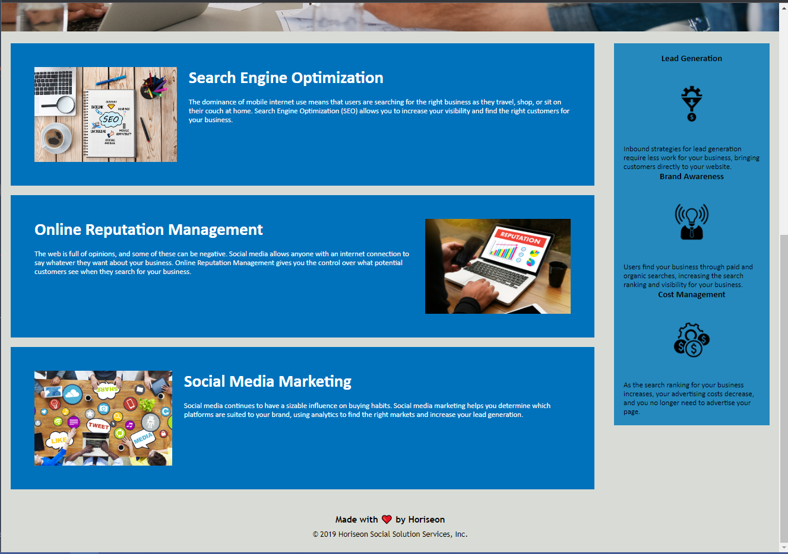

# <Module 1 challenge>

## Description

The motivavtion for this project was to refactor the provided code in order to put the html and css style sheets into a logical and sequencial order with semantic html elements. Alt attributes were added to the images in the html document in order to increase the accesability of the site and improve its rating in google searches.  

## Screenshots

screenshots of what the web application looks like when up and running 

## Link to the Deployed Application

[deployed website](https://elissamaine.github.io/maine-challenge-1/)
